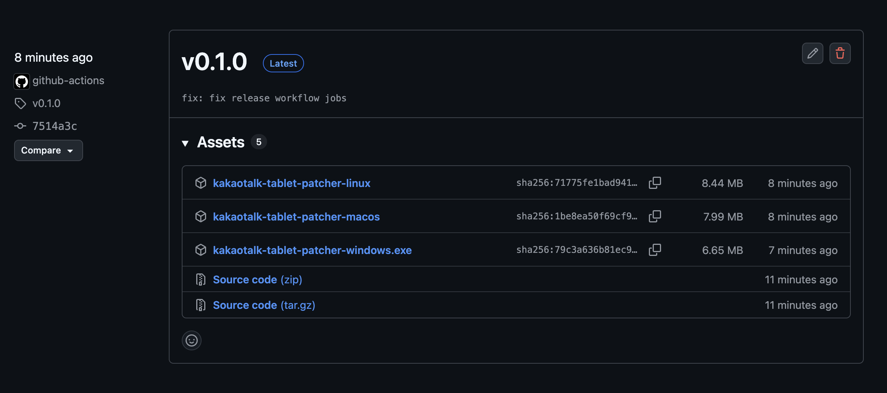
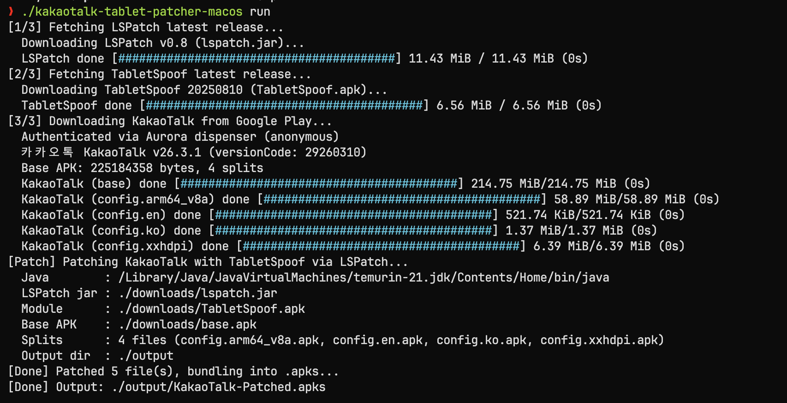
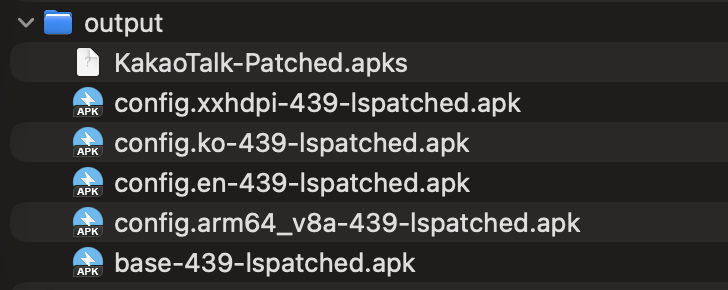
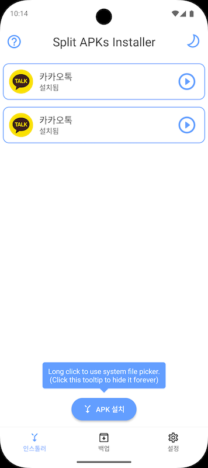
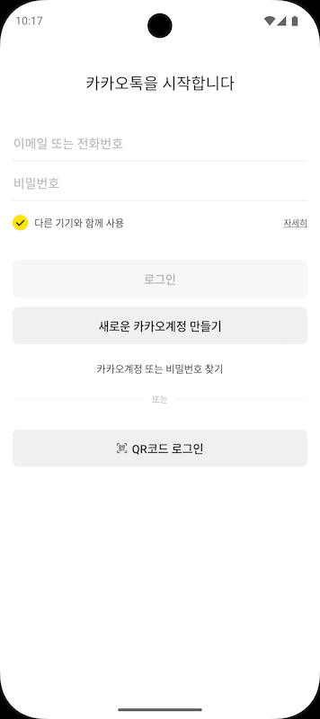

카카오톡은 공식적으로 갤럭시 태블릿에서만 다중 기기 로그인을 지원합니다. 하지만 약간의 패치를 통하면 갤럭시 태블릿이 아닌 다른 외산 태블릿과 모바일 기기에서도 해당 기능을 사용할 수 있습니다.

## 패치 도구 다운로드

먼저 패치를 위한 도구를 다운로드 해야 합니다. [여기](https://github.com/ny0510/kakaotalk-tablet-patcher/releases)에서 OS에 알맞는 파일을 다운로드하세요.



## 패치 적용하기

다운로드한 패치 도구가 있는 폴더에서 터미널을 열고 OS에 맞는 명령어를 입력하여 패치를 적용하세요.

```bash
# Windows
.\kakaotalk-tablet-patcher-windows.exe run

# Linux
./kakaotalk-tablet-patcher-linux run

# macOS
./kakaotalk-tablet-patcher-macos run
```



`run` 옵션을 사용하면 패치 도구가 자동으로 최신 버전의 LSPatch, TabletSpoof, 그리고 카카오톡 APK를 다운로드하여 패치를 진행합니다.

패치가 완료되면 `output` 폴더에 `KakaoTalk-Patched.apks` 파일이 생성됩니다.



### 패치된 APKs 설치하기

APKs 파일을 설치하기 위해서는 [Android Split APKs Installer](https://github.com/aefyr/SAI)와 같은 도구가 필요합니다.

APKs 파일을 설치할 기기에 복사한 뒤, SAI 앱을 열고 `KakaoTalk-Patched.apks` 파일을 선택하여 설치를 진행하세요.



또는 아래 ADB 명령어를 사용하여 설치할 수도 있습니다.

```bash
adb install-multiple -r output/*.apk
```

## 설치 확인

설치된 카카오톡을 실행해 보면 '다른 기기와 함께 사용' 옵션이 활성화되어 있는 것을 확인할 수 있습니다.


