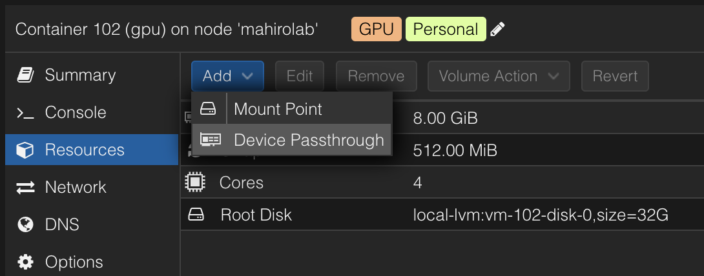

이 글은 PVE 9.X `(pve-manager/9.0.11/3bf5476b8a4699e2 (running kernel: 6.14.11-4-pve))` 환경을 기준으로 작성되었습니다.

## 사전 작업

Nvidia GPU 드라이버 빌드 시 현재 커널의 헤더를 사용함으로 먼저 커널을 최신 버전으로 업데이트 해줍니다.

```sh
apt update && apt full-upgrade -y
reboot
```

그 다음 현재 동작중인 커널 버전을 확인하고 알맞은 헤더 패키지를 설치합니다.

```sh
uname -r
apt install pve-headers-$(uname -r) -y
```

마지막으로 빌드를 위한 패키지를 설치합니다.

```sh
apt install build-essential -y
```

## Nouveau 드라이버 비활성화

Proxmox에는 기본적으로 Nouveau 오픈소스 드라이버가 설치되어 있습니다. 이 드라이버는 Nvidia의 공식 드라이버와 충돌을 일으키므로 비활성화해야 합니다.

```sh
echo "blacklist nouveau" >> /etc/modprobe.d/blacklist-nouveau.conf
update-initramfs -u
reboot
```

## Nvidia 드라이버 설치

[Nvidia 드라이버 다운로드 페이지](https://www.nvidia.com/drivers/)에서 자신의 GPU에 알맞은 드라이버의 설치 링크를 복사한 뒤 아래 명령어를 통해 설치합니다.

이 글에서는 [580.95.05 버전](https://us.download.nvidia.com/XFree86/Linux-x86_64/580.95.05/NVIDIA-Linux-x86_64-580.95.05.run)을 예시로 사용합니다.

```sh
wget https://us.download.nvidia.com/XFree86/Linux-x86_64/580.95.05/NVIDIA-Linux-x86_64-580.95.05.run
chmod a+x NVIDIA-Linux-x86_64-580.95.05.run
./NVIDIA-Linux-x86_64-580.95.05.run
```

설치 도중에 `nvidia-xconfig` 패키지 설치를 묻는 질문이 나옵니다. X 서버를 사용하지 않을 것이므로 `No`를 선택합니다.

설치가 완료되면 `nvidia-smi` 명령어를 통해 드라이버가 정상적으로 설치되었는지 확인할 수 있습니다.

```sh
nvidia-smi
```

## LXC 컨테이너 설정

PVE 웹 대시보드에 접속한 뒤 GPU 패스스루를 설정할 LXC 컨테이너의 `Resource` 탭으로 이동하여 `Device Passthrough` 항목을 선택하여 추가합니다.

아래 디바이스들을 추가하면 됩니다.

간혹 일부 시스템에 따라 몇몇 경로가 존재하지 않을 수도 있습니다. 이 경우 존재하는 경로만 추가해주면 됩니다.

```sh
/dev/nvidia0
/dev/nvidiactl
/dev/nvidia-modeset
/dev/nvidia-uvm
/dev/nvidia-uvm-tools
/dev/nvram
```



## 컨테이너 내 드라이버 설치

Device Passthrough 설정이 완료되었으면 LXC 컨테이너에 접속하여 Nvidia 드라이버를 설치합니다.

호스트에 설치했던 것과 동일한 과정이지만 이번에는 `--no-kernel-module` 옵션을 추가하여 커널 모듈 설치를 건너뜁니다.

```sh
wget https://us.download.nvidia.com/XFree86/Linux-x86_64/580.95.05/NVIDIA-Linux-x86_64-580.95.05.run
chmod +x NVIDIA-Linux-x86_64-580.95.05.run
./NVIDIA-Linux-x86_64-580.95.05.run --no-kernel-module
```

이제 컨테이너 내에서 `nvidia-smi` 명령어를 통해 GPU가 정상적으로 인식되는지 확인할 수 있습니다.

```sh
nvidia-smi
```
